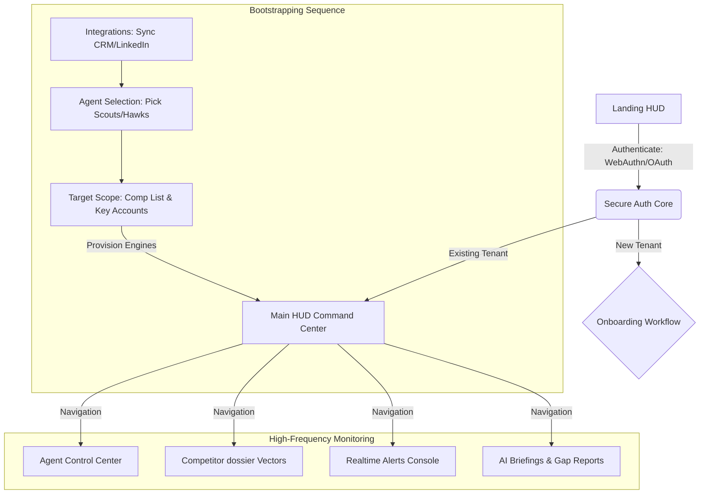
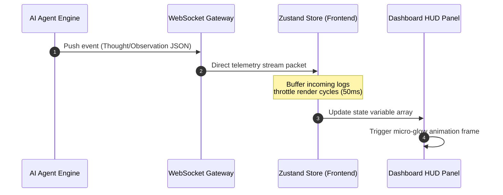

# ShadowRep AI — Autonomous GTM Revenue Intelligence Platform
## Comprehensive Frontend Dashboard Architecture & UI Layout Blueprint

ShadowRep AI is engineered as a **"Futuristic AI Command Center for Revenue Intelligence"** (Bloomberg Terminal meets advanced autonomous AI agents). This document details the layout design, navigation flows, design tokens, reusable components, and reactive data streams necessary to support high-frequency telemetry tracking.

---

## 1. Full Application Lifecycle Flow



### 1.1 Landing HUD Page
*   **Theme & Design**: Ultra-dark backdrop (`#030712`), pixel-grid matrix background, micro-glitch typography, and a central interactive wireframe showing active agents parsing public datasets in real time.
*   **Dynamic Interactive Demo**: A functional pseudo-terminal on the homepage. Visitors can enter a competitor's domain name, and simulated agents perform a real-time mock scan of pricing changes, employee movements, and technology shifts.
*   **Core Call to Actions (CTAs)**:
    *   `[BOOTSTRAP AGENT CORE]` (Primary glowing cyan call-to-action).
    *   `[READ TECHNICAL PROTOCOL]` (Secondary mono-border link to documentation).

### 1.2 Authentication Flow
*   **Stealth Login**: Full screen interface utilizing CSS matrix scanlines. The backdrop features a faint, auto-updating global GTM feed ticker.
*   **Security Mechanisms**:
    *   Multi-tenant SSO (SAML/OpenID) and standard OAuth (GitHub, Google, Auth0).
    *   *WebAuthn (Passkeys)* with customized neon authorization animations.
    *   Fallback monospaced MFA security-key prompt screens.

### 1.3 Bootstrapping Onboarding Flow
*   **Stage 1: Enterprise Integrations**: Grid select screen for database permissions (Salesforce, HubSpot, Gong, LinkedIn Sales Navigator, Google BigQuery). Connectors display real-time ping/latency responses.
*   **Stage 2: Provisioning Agents**: The user selects GTM agents to activate. Interactive dials let users configure scanning frequencies, target industries, and total budget allocations per agent.
*   **Stage 3: Setting Targets**: Input fields to configure target domain scopes, competitor list targets, and high-value target accounts. Clicking `[EXECUTE INITIAL PROTOCOL]` starts a simulated matrix boot sequence leading into the dashboard.

---

## 2. Dashboard Navigation Structure

```
+---------------------------------------------------------------------------------------------------+
|  [|||] ShadowRep AI  // SYSTEM HUD   [Node: SG-West]  [Latency: 12ms]   (Q) [Command Palette] [Profile] |
+---------------------------------------------------------------------------------------------------+
|  ( ) OVERVIEW      |  Home > Dashboard > Agents                                                   |
|  (A) AGENTS [3]    |  +------------------------------------------------------------------------+  |
|  (C) COMPETITORS   |  |                                                                        |  |
|  (I) AI INSIGHTS   |  |                       MAIN DYNAMIC CONTENT PANEL                       |  |
|  (M) MARKET INTEL  |  |                                                                        |  |
|  (X) ALERTS (!5)   |  +------------------------------------------------------------------------+  |
|  (S) DIAGNOSTICS   |  [SYSTEM OK]                                            [ Metered credits: 89% ]  |
+---------------------------------------------------------------------------------------------------+
```

### 2.1 Sidebar (Left Panel - Collapsible)
*   **Fixed HUD Width**: 260px (`w-64`). Collapses to 68px (`w-16`) showing icons with monospaced tooltip overlays.
*   **Interactive Elements**:
    *   `Overview`: HUD Grid featuring high-level metrics.
    *   `Agents`: Real-time telemetry monitoring panel showing provisioned sub-agents.
    *   `Competitors`: Matrix tracks for target domain vectors.
    *   `AI Insights`: High-level strategic Briefings, comparative models, and counter-campaign outputs.
    *   `Market Intel`: Raw global scraping logs (SEC, press releases, hiring trends).
    *   `Alerts`: Incident Log showing critical data alerts. Includes a glowing badge with the number of unread high-priority events (e.g., `[!5]`).
    *   `Diagnostics (Settings)`: API keys, webhook controllers, organization controls.

### 2.2 Top Navbar (HUD Dashboard Bar)
*   **Compact Height**: 64px (`h-16`) utilizing glassmorphic backdrop filters and thin lower borders (`border-b border-slate-800`).
*   **Elements**:
    *   *System Navigation*: A minimalist logo beside system status diagnostics: `[Node: US-East-1] [Status: Synchronized] [Active Scrapers: 48/48]`.
    *   *Command Palette Gateway*: Center-positioned keyboard shortcut bar displaying `[Press ⌘K to open command console]`. Clicking triggers the system-wide spotlight panel.
    *   *Notification Center Drawer*: Glowing alert toggle that sounds a subtle retro hover tick when hovered. It opens an overlay panel displaying high-priority logs.
    *   *Profile & Seating Info*: Shows the current organization seat, active credit gauge (e.g., `Tokens: 89.2k / 100k`), and user avatar with terminal border frames.

---

## 3. Main Dashboard Layout Design

The dashboard layout utilizes a high-density, multi-panel HUD grid configuration optimized to fit full-screen workspaces (`100vh`) with zero scroll overflows on core widgets.

```
+------------------------------------+------------------------------------+
| PANEL 1: AI Agent Telemetry       | PANEL 2: Live GTM Feed             |
| - Agent CPU/RAM gauges (svg logs)  | - Chronological scrolling stream   |
| - Glowing state indicators         | - Color coded priority items       |
+------------------------------------+------------------------------------+
| PANEL 3: Competitor Pricing Map   | PANEL 4: Tactical AI Insights      |
| - High-contrast line charts        | - GTM Gap reports summaries        |
| - Bulleted alerts                  | - Counter-campaign drafts          |
+------------------------------------+------------------------------------+
```

### 3.1 Grid Layout Modules
*   **Module A: AI Agent Telemetry Grid**: Displays running sub-agent clusters (e.g., `SEC_Scout`, `Pricing_Hawk`). Shows real-time token/second usage, CPU loads, active tools (e.g., `crawling_dns`), and their running memory logs.
*   **Module B: Live GTM Feed Tracker**: High-frequency terminal ticker logging competitive discoveries. Events are categorized using custom styles:
    *   `CRITICAL (Red)`: Competitor updated enterprise pricing models.
    *   `SIGNAL (Cyan)`: High-value account hired a new VP of Sales (sales trigger).
    *   `INFO (Green)`: Agent finished indexing patent database files.
*   **Module C: Competitor Pricing Vectors**: Dual-axis line and area charts. Displays changes in pricing tiers matched against your market positioning.
*   **Module D: Tactical AI Insights Summary**: Glowing cards housing generated tactical summaries (e.g., *"Competitor X is transitioning from seat-based pricing to usage-based models in EMEA. Recommend deploying sales playbook Y."*).
*   **Module E: Alerts & Incident Dashboard**: Dynamic counter lists displaying anomalous alerts (e.g., "Web scraper flagged a change in Competitor Y's landing page CTA").

---

## 4. Page-by-Page Layout Specifications

### 4.1 Overview HUD Dashboard (`/dashboard`)
*   **HUD Grid Configuration**: `grid grid-cols-12 gap-4 h-[calc(100vh-8rem)] overflow-hidden`
*   **Layout Divisions**:
    *   *Cols 1-8 (Top)*: `Metric Ticker Panel` (4 core high-impact numbers) + `Main Market Trend Graph` (Area Chart showing aggregate competitor pricing indices).
    *   *Cols 9-12*: `Live GTM Feed` (Vertical auto-scrolling console).
    *   *Cols 1-6 (Bottom)*: `Active Agent Status` (Horizontal telemetry grids).
    *   *Cols 7-12 (Bottom)*: `Actionable GTM Insights` (High-priority reports checklist).

### 4.2 Competitor Dossiers (`/dashboard/competitors`)
*   **Two-Panel Layout**:
    *   *Left Pane (Width: 320px)*: High-density list of tracked competitor domains. Clicking updates the active dossier in the right pane.
    *   *Right Pane (Dynamic)*: Details the active competitor's profile:
        *   *Tab 1 (Pricing Vectors)*: Visual history showing variations in public SaaS tier tables.
        *   *Tab 2 (Marketing Telemetry)*: Live CTA shift alerts and SEO modifications.
        *   *Tab 3 (Org Movements)*: Senior hires, open roles, and department sizing adjustments.

### 4.3 Alerts Hub (`/dashboard/alerts`)
*   **High-Volume Grid Layout**:
    *   *Header Section*: Real-time incident counts, filter bars (`Severity`, `Origin Agent`, `Destination Node`), and bulk actions (`[RESOLVE ALL]`, `[DISPATCH SLACK]`).
    *   *Main Body*: Multi-row table of alerts. Clicking a row triggers a lateral side-drawer detailing the underlying DOM diff or crawled file context.

### 4.4 AI Reports Center (`/dashboard/insights`)
*   **Dossier Reader View**: Single-column view mimicking an interactive PDF terminal. Left panel lists strategic gap reports, and the right panel renders the report layout using markdown formatting and integrated charts. Reports feature an `[EXPORT AS PDF]` button and a slack link.

### 4.5 Market Intelligence Logs (`/dashboard/market-intel`)
*   **Split Screen Visualizer**:
    *   *Left Pane*: Interactive map plotting SEC filing dates, patent databases, and social signals.
    *   *Right Pane*: Direct PDF reader displaying marked sections indicating competitive GTM pivots.

### 4.6 Sub-Agent Orchestrator (`/dashboard/agents`)
*   **Cluster HUD Grid**: Card grid layout representing each sub-agent. Clicking an agent expands the terminal panel downwards to reveal real-time execution steps (`Thought -> Action -> Observation`), active API targets, and historical billing/credit usage graphs.

### 4.7 Diagnostics Settings (`/dashboard/settings`)
*   **Tabbed Command Settings Panel**:
    *   `Profile`: Multi-tenant org roles, team memberships, active session logs.
    *   `Integrations`: Status grid for Salesforce, Hubspot, LinkedIn API keys.
    *   `Billing`: Active credits, cost limits, and auto-top-up toggles.
    *   `System`: Custom rules defining alerts thresholds, notification destinations, and scrapers latency configurations.

---

## 5. Reusable Component Specifications

### 5.1 Metric Cards (`components/dashboard/grid-card.tsx`)
```tsx
// Example UI structure
<div className="relative border border-slate-800 bg-slate-950/80 p-4 font-mono shadow-md backdrop-blur">
  {/* Corner Bracket decorations */}
  <div className="absolute left-0 top-0 h-2 w-2 border-l border-t border-cyan-500" />
  <div className="absolute right-0 top-0 h-2 w-2 border-r border-t border-cyan-500" />
  
  <div className="text-xs text-slate-500 uppercase font-semibold">Buying Signals</div>
  <div className="mt-2 flex items-baseline gap-2">
    <span className="text-2xl font-bold tracking-tight text-slate-100">1,248</span>
    <span className="text-xs text-emerald-400 font-semibold">+18.4%</span>
  </div>
</div>
```

### 5.2 Agent Telemetry Card (`components/agents/agent-card.tsx`)
*   Displays agent status, processing speed (e.g., `124/req min`), dynamic radar skill charts, and active thread switches.
*   Includes a small, real-time Canvas showing CPU wave frequencies in neon green.

### 5.3 Step Debugger Component (`components/agents/step-debugger.tsx`)
*   Vertical timeline component tracking sub-agent execution pathways:
    *   `[THOUGHT]`: Deciding which tools to use.
    *   `[ACTION]`: Pulling data from target domain `/pricing` page.
    *   `[OBSERVATION]`: Found CTA changes from "Free Trial" to "Contact Sales".

### 5.4 High-Density Live Ticker Table (`components/ui/table.tsx`)
*   Compact, borderless rows with tight paddings. Features high contrast data listings, and rows blink on updates using CSS animation triggers.

---

## 6. UX & Motion Design (Framer Motion Presets)

Motion in ShadowRep AI should feel fast and clean. Avoid slow, heavy easing animations. Maintain a crisp, digital style.

### 6.1 Framer Motion Presets

```typescript
// Fast terminal boot transition
export const terminalBootPreset = {
  initial: { opacity: 0, scaleY: 0.05 },
  animate: { opacity: 1, scaleY: 1 },
  transition: { duration: 0.35, ease: [0.16, 1, 0.3, 1] }
};

// Low-latency HUD item list transition
export const hudListItemPreset = {
  initial: { x: -20, opacity: 0 },
  animate: { x: 0, opacity: 1 },
  transition: { type: "spring", stiffness: 400, damping: 30 }
};

// High-frequency telemetry update glitch effect
export const telemetryGlitchPreset = {
  animate: {
    skewY: [0, -1, 1, 0, 2, -2, 0],
    x: [0, -2, 2, 0, 1, -1, 0]
  },
  transition: {
    duration: 0.4,
    repeat: Infinity,
    repeatType: "reverse" as const,
    repeatDelay: 5
  }
};
```

### 6.2 Visual Effects & Indicators
*   **Scanline Overlay**: Adds subtle CSS scanline animations to high-priority alert cards to draw attention to critical events.
*   **Active Telemetry Indicators**: Pulsing glowing green LEDs next to active sub-agents. They increase frequency when agents are executing scrapers or vector lookups.
*   **Loading State Skeletons**: Glowing skeletons that mimic the user's color scheme (Amber/Cyan), simulating retro system terminal diagnostics loading.

---

## 7. ShadowRep AI Design System Tokens

### 7.1 Dark Thematic Palette

| Token | Hex Value | Purpose |
|---|---|---|
| `--stealth-black` | `#080C14` | System background canvas |
| `--stealth-grid` | `#0B132B` | HUD layouts, inner borders, side navigation |
| `--cyber-cyan` | `#00F0FF` | Primary telemetry, normal streams, charts |
| `--toxic-green` | `#39FF14` | Active status indicators, successful actions |
| `--warning-amber` | `#FFB800` | Medium severity alerts, token warnings |
| `--crimson-alert` | `#FF0055` | Critical alerts, security breaches, UI errors |
| `--terminal-white` | `#E2E8F0` | Primary monospaced text |
| `--terminal-slate` | `#64748B` | Secondary details, timestamp logs |

### 7.2 Typography Token Hierarchy
*   **Primary System Font**: `Outfit` (sleek, high-tech B2B marketing vibes)
*   **Terminal & Telemetry Font**: `JetBrains Mono` or `Fira Code` (strictly used for data grids, agent console logs, metrics, alerts, and navigation links).
*   **Hierarchy Scale**:
    *   `h1`: `font-outfit font-extrabold text-3xl tracking-tight`
    *   `h2`: `font-outfit font-bold text-xl tracking-tight`
    *   `metrics`: `font-mono font-bold text-2xl tracking-tighter`
    *   `logs`: `font-mono text-xs leading-5 tracking-normal`

### 7.3 Grid Layout Tokens
*   **Component Border Radius**: `rounded-none` or `rounded-sm` (stealth, rectangular cuts with micro-borders).
*   **Border Widths**: `border border-slate-800` / `divide-y divide-slate-800`.
*   **Spacing System**: Base 4 (`gap-1` = 4px, `gap-2` = 8px, `gap-4` = 16px, `gap-6` = 24px) to ensure absolute alignment across dashboard grids.

---

## 8. Enterprise SaaS Best Practices

### 8.1 Layout Responsiveness
*   The dashboard HUD is designed for high-resolution displays (`1440px` and above).
*   For tablet/mobile screens, the left sidebar automatically collapses into a bottom toolbar, and HUD grids stack sequentially to maintain readability.

### 8.2 System Accessibility
*   **Screen Readers**: Core telemetry widgets and dynamic charts feature `aria-live="polite"` regions so automated updates are read dynamically.
*   **Keyboard Navigation**: Full support for `Tab` focusing across console rows. Selecting an alert can be triggered by pressing `Space` or `Enter`.
*   **Color-Blindness Adaptability**: Telemetry status badges don't rely on color alone. Status tags always pair a color indicator with clear text labels (e.g., `[ACTIVE]`, `[SUSPENDED]`, `[DRY_RUN]`).

---

## 9. Real-Time Telemetry Data Flow



### 9.1 Stream Management & Performance
1.  **High-Frequency Telemetry**: Agent activities generate updates at rates up to 100hz. To prevent UI lockups, the `webSocketClient.ts` uses an internal buffer.
2.  **State Updating**: Incoming telemetry streams are buffered locally in the Zustand Store and flushed to the rendering component at a throttled rate (every 50ms).
3.  **Local Storage Cache**: Core dashboard preferences (e.g., active theme, workspace filters, muted competitors) are persisted locally in the browser.

---

## 10. Core Component Directory Tree & Hierarchy

For maximum maintainability and clear division of labor, frontend components should adhere to the following architecture:

```
src/
├── app/                      # Page routing, layouts, and loading/error fallbacks
├── components/               # Global shared widgets and layout components
│   ├── ui/                   # Raw atomic UI primitives (Shadcn customized)
│   ├── layout/               # Top-level framework wrappers (Sidebar, HUD Nav)
│   └── charts/               # Recharts telemetry graphs wrapper components
│
└── features/                 # Modular, feature-specific business domains
    ├── competitor-monitoring/# Context: Scrapers list, comparative metrics, and pricing diffs
    │   ├── components/       # Feature components: CompetitorProfile, PriceMatrix
    │   ├── hooks/            # Feature hooks: usePriceStream, useCompetitorData
    │   └── services/         # API hooks: competitorApi.ts
    │
    └── ai-insights/          # Context: Strategic briefs, prompts, LLM summaries
        ├── components/       # Feature components: InsightCard, PromptConsole
        └── hooks/            # Feature hooks: useInsightBriefs
```

### 10.1 Key Recommendations for Frontend Scalability
*   **Zero Feature Coupling**: Components located in `features/competitor-monitoring` must never import assets directly from `features/ai-insights`. Shared models and shared state must always be elevated to global layers (`/components`, `/hooks`, `/store`).
*   **Server-Side Layout Isolation**: Next.js Server Components should handle initial page states, SEO metadata, and permission checks. Interactive widgets should then be hydrated on the client side using minimal Client Components.
*   **Lazy Loading Graphing Widgets**: Heavy telemetry charts (`components/charts/*`) should be imported dynamically utilizing Next.js `dynamic()` imports to minimize the initial page load time.
